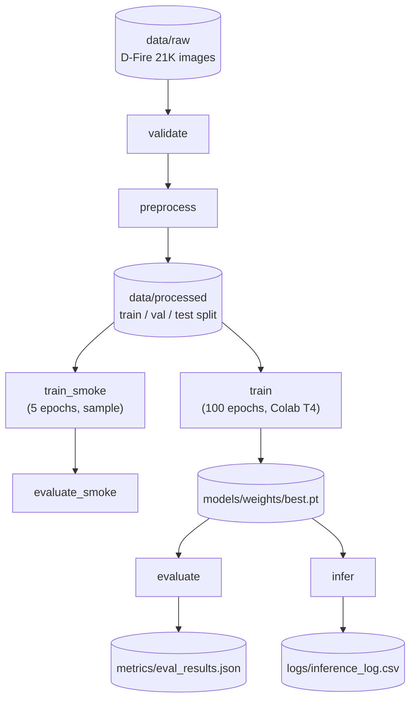
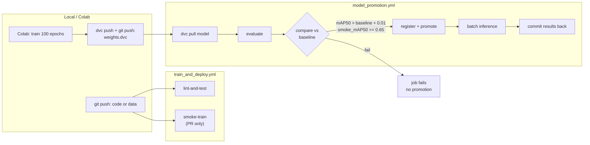

# FireWatch-CI 🔥

[](https://github.com/tobni-islam/firewatch-ci/actions/workflows/train_and_deploy.yml)
[](https://github.com/tobni-islam/firewatch-ci/actions/workflows/model_promotion.yml)
[](https://firewatch-ci-n66upqfbncipnrwa4pggct.streamlit.app/)

An end-to-end MLOps pipeline for fire and smoke detection. YOLOv8s fine-tuned on the
D-Fire dataset (21K images), with automated evaluation, metric-gated model promotion,
and drift monitoring via GitHub Actions, DVC, and MLflow.


## Architecture

### DVC data and training pipeline



### CI/CD promotion pipeline



---

## Quickstart

```bash
git clone https://github.com/tobni-islam/firewatch-ci.git
cd firewatch-ci
poetry install
poetry shell


# Pull data and trained model weights from DagsHub:
dvc pull

# Run the full smoke-test pipeline locally (~5 min, CPU):
dvc repro train_smoke evaluate_smoke
```

---

## API usage

```bash
# Start the inference service:
poetry run bentoml serve service/service.py:svc --port 3000

# Detect fire or smoke in an image:
curl -X POST http://localhost:3000/detect \
  -H "Content-Type: multipart/form-data" \
  -F "image=@path/to/image.jpg"

# Example response:
# {
#   "detections": [{"class": "fire", "confidence": 0.87, "bbox": [120, 45, 380, 290]}],
#   "num_detections": 1,
#   "alert_level": "HIGH",
#   "classes_detected": ["fire"]
# }

# Test the alert webhook endpoint directly:
curl -X POST http://localhost:3000/webhook_fire \
  -H "Content-Type: application/json" \
  -d '{"alert_level": "HIGH", "source": "manual-test", "detections": []}'

# Set WEBHOOK_URL to auto-trigger the webhook from /detect on HIGH alerts:
WEBHOOK_URL=http://localhost:3000/webhook_fire \
  poetry run bentoml serve service/service.py:svc --port 3000
```

---

## CI/CD pipeline detail

### `train_and_deploy.yml` — triggers on push to `master` or pull request

| Job | Trigger | Steps |
|---|---|---|
| lint-and-test | push to master, PR | black, flake8, isort, pytest |
| smoke-train | PR only | dvc pull sample → 5-epoch train → evaluate |

### `model_promotion.yml` - triggers when `metrics/train_results.json` changes

| Step | Action |
|---|---|
| Pull model | `dvc pull models/weights/` from DagsHub |
| Evaluate | `evaluate.py` on held-out test set |
| Compare | Exit 1 if new mAP50 ≤ baseline + 0.01 or smoke_mAP50 < 0.65 |
| Register | Archive old Production, promote new version in MLflow Registry |
| Batch infer | Run inference on test set → update `logs/inference_log.csv` |
| Commit back | `github-actions[bot]` commits eval results with `[skip ci]` |

### `drift_report.yml` — runs every Monday 09:00 UTC

Compares `logs/inference_log.csv` against `logs/reference_log.csv` using
Evidently `DataDriftPreset` + per-column drift metrics. HTML report committed
to `reports/drift_report.html`.

---

## Tech stack

| Component | Tool | Version |
|---|---|---|
| Detection model | YOLOv8s (Ultralytics) | 8.x |
| Data versioning | DVC + DagsHub | 3.x |
| Experiment tracking | MLflow (DagsHub-hosted) | 2.x |
| CI/CD | GitHub Actions | — |
| Model serving | BentoML | 1.2.2 |
| Drift monitoring | Evidently AI | 0.4.x |
| Dashboard | Streamlit | 1.30+ |
| Training compute | Google Colab T4 (free tier) | — |
| Dependency management | Poetry | 1.7.x |

---

## Links

- **DagsHub (experiments + model registry):** https://dagshub.com/islam_tb/firewatch-ci
- **Live dashboard:** https://firewatch-ci-n66upqfbncipnrwa4pggct.streamlit.app/
- **Dataset:** [D-Fire](https://github.com/gaiasd/DFireDataset) — 21,527 annotated fire/smoke images
